# Pulsar Segmentation and Analysis (PulsarS&A)

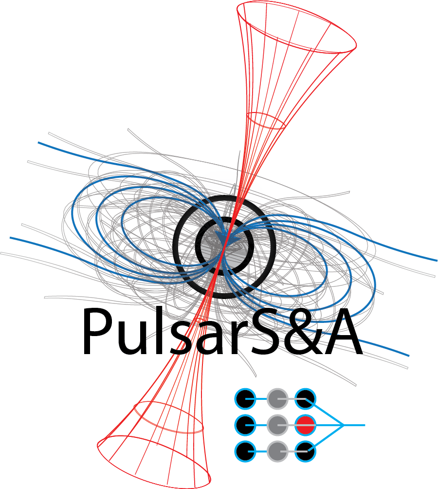

Welcome to the **Pulsar Segmentation and Analysis (PulsarS&A)** package of **ML-PPA**. This package is designed to provide robust pipelines for the segmentation and analysis of pulsar signals from frequency-time dispersion graphs. It includes tools and models that facilitate efficient processing and identification of pulsar signals from noisy observational data.

### What's new in version 0.2

In this version, we introduce several key updates compared to version 0.1:

- **Enhanced Connected Component Analysis** : The pipeline for classifying segments as pulsars has been streamlined, improving accuracy and efficiency in identifying meaningful connected components
- **DelayGraph** : A new method was introduced for generating signals based on dispersion curves. These signals are classified using both a neural network and a legacy linear curve-fitting method, combining modern and traditional techniques for robust analysis.
- **FilterCNN** : An additional layer of filtering was integrated into the segmentation process. This enhances the output from the UNet, improving the downstream classification of pulsar signals by refining the initial segmentation.
- **Modular Pipeline** : The entire workflow has been modularized using classes, enabling the development of custom pipelines tailored to specific needs. This ensures flexibility and adaptability in processing pipelines.
- **Pipeline Tuning** :  A similar pipeline trained on different data subgroups, each containing distinct noise signal types, can later be leveraged to develop a parametric model. This model would enable pulsar signal detection without requiring retraining of the neural network modules, while encountering similar noise sources at varying amplitudes and rates.

### Features

- **Pulse Trace Segmentation:** PulsarS&A leverages Convolutional Neural Networks (CNNs), specifically the **UNet architecture**, to accurately segment pulsar signals from frequency-time dispersion graphs.
  
- **Noise Filtering:** After segmentation, the pipeline applies a simple encoder-decoder CNN (referred to as **FilterCNN**) to filter out small noisy patches that may interfere with signal identification.

- **Signal Labeling:** The package employs connected component analysis and delay-graph analysis to further classify and label the segmented pulsar signals.

### Applications

PulsarS&A is designed to assist in automating the detection and analysis of pulsar signals in large datasets, streamlining the process for researchers working in the field of radio astronomy.

This repository provides both the core algorithms and the framework for training and deploying the neural networks required for pulsar signal segmentation.

If you want to run and test the code, we recommend starting with the  [Tutorial Project](https://gitlab.com/ml-ppa/tutorial_project), where you can use a containerized solution for convenience. 

You can also compile and run it locally using virtual environments; therefore, follow the steps explained in the next section. 

## Getting Started
### Setup to run it locally
We recommend using virtual environment for running this package. This will help organize dependencies and avoid conflics with packages you have installed globally on your computer. You can create a virtual environment with the following command:

```
python3 -m venv <venv_name>
``` 
followed by activating the virtual environment as:
```
source <venv_name>/bin/activate
```
If you have activated the virtual environment, you should see the name <venv_name> at the beginning of the command prompt in your terminal. The required packages or dependencies then can be installed in the virtual environment as:
```
pip install -r requirements.txt
```
From here the example python script or the Jupyter Notebooks can be run. You can use the notebooks with a text editor like Visual Studio Code or by running a Jupyter server. To create a custom kernel and run the server use the following:
```
python -m ipykernel install --user --name=<venv_name>
jupyter notebook
```
## Introduction
The image below illustrates the frameworks  used in the pipeline.

***Framework of pipeline [PipelineImageToFilterToCCtoLabels](src/pulsar_analysis/pipeline_methods.py#L1176)***

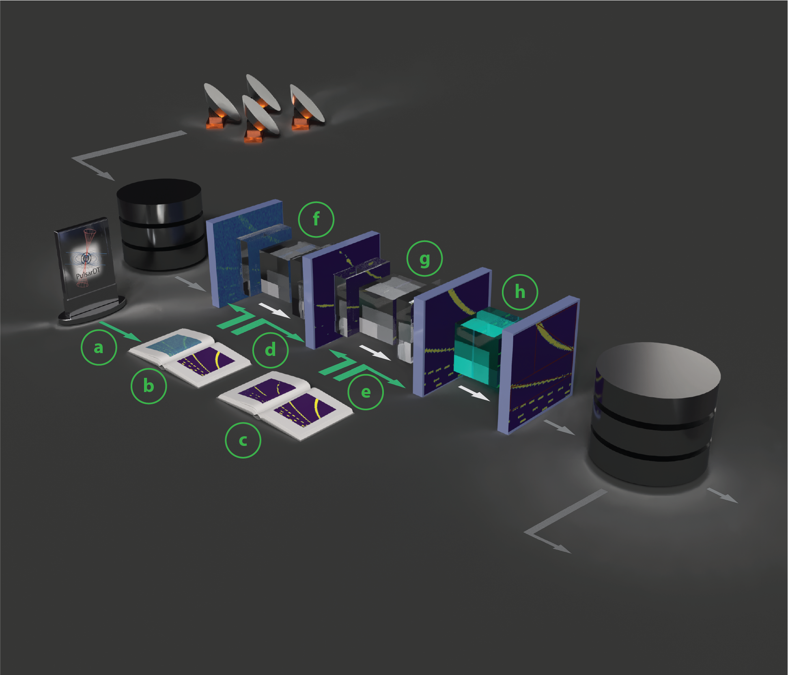

Here are the list of modules used to perform different steps in the pipeline:
- ***Loaders:*** Data loaders+converters **(a)** from PulsarDT payload files: [PrepareFreqTimeImage](src/pulsar_analysis/preprocessing.py#L140), 
[LabelReader](src/pulsar_analysis/pipeline_methods.py#L76) 
- ***Datasets:*** Data sets for training, testing, visulalization **(b)**, **(c)** : [ImageDataset](src/pulsar_analysis/pipeline_methods.py#L107), [ImageToMaskDataset](src/pulsar_analysis/train_neural_network_model.py#L150), [InMaskToMaskDataset](src/pulsar_analysis/train_neural_network_model.py#L238), [LabelDataSet](src/pulsar_analysis/pipeline_methods.py#L149)
- ***Trainers*** Trainer modules **(d)**, **(e)**  to train CNNs **(f)** and **(g)** for segmentation and filtering [TrainImageToMaskNetworkModel](src/pulsar_analysis/train_neural_network_model.py#L331)
- ***Labellers:*** Legacy vision tools **(h)** to label segments into different signal source types ***(Pulsar, NBRFI, BBRFI)***  [ConnectedComponents](src/pulsar_analysis/postprocessing.py#L247)

The filtering step **(c)**, **(e)**, **(g)** can be skipped if the segmentation is satisfactory using another ***Framework [PipelineImageToCCtoLabels](src/pulsar_analysis/pipeline_methods.py#L844)***

***Framework of pipeline [PipelineImageToFilterDelGraphtoIsPulsar](src/pulsar_analysis/pipeline_methods.py#L1176)***

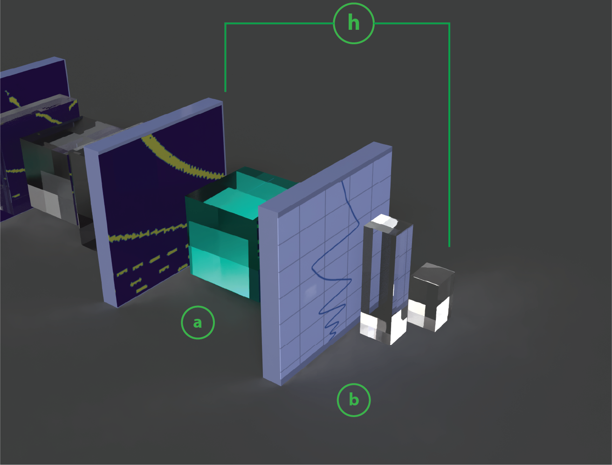

Compared to the previous pipeline [PipelineImageToFilterToCCtoLabels](src/pulsar_analysis/pipeline_methods.py#L1176), where **(h)** was a connected component anaylsis, in this framework [PipelineImageToFilterDelGraphtoIsPulsar](src/pulsar_analysis/pipeline_methods.py#L512) a different approach is used to identify pulsar signals as illustrated in the graphics above **(a)** and **(b)**. 
- **(a)** illustrates a module [DelayGraph](src/pulsar_analysis/postprocessing.py#L11) to convert the segmented image into a 1D graph by adding the intensity along all the freq channels. So if pulsar signal is present, it gives a characteristic shape
- The characteristic shape is later classified by the 1D CNN **(b)** as pulse or non pulse. The neural network of this type can be trained using this module [TrainSignalToLabelModel](src/pulsar_analysis/train_neural_network_model.py#L563) and the dataset for training

***Visual Description of the framework modules***
- ***Primary Load engines:***
Load engines are modules designed to load payload files upon call (currently limited to specific file types but planned for expansion in future versions) generated by PulsarDT. These engines convert the payload files into dispersion graphs and extract other relevant information.

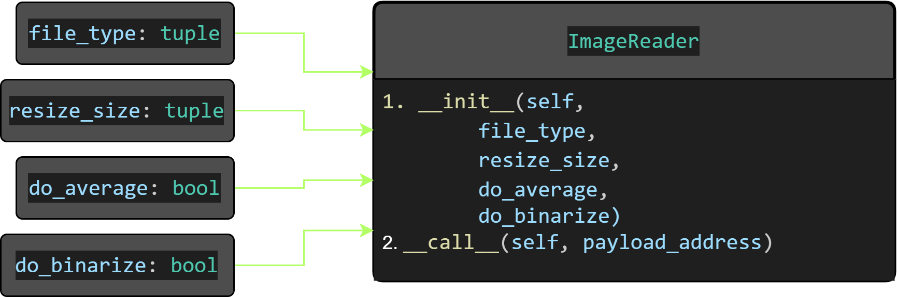

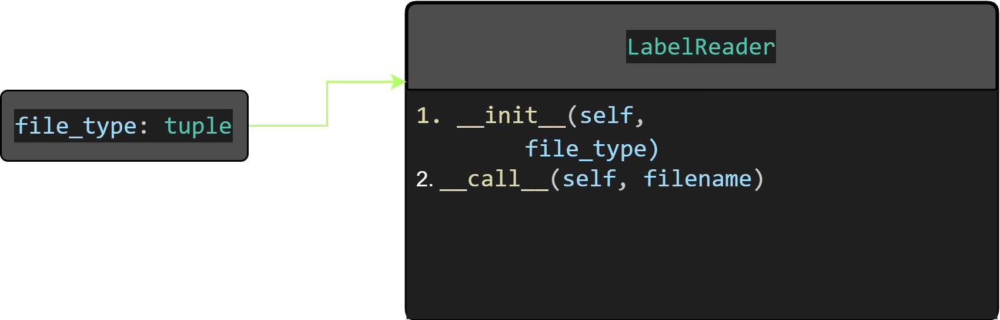

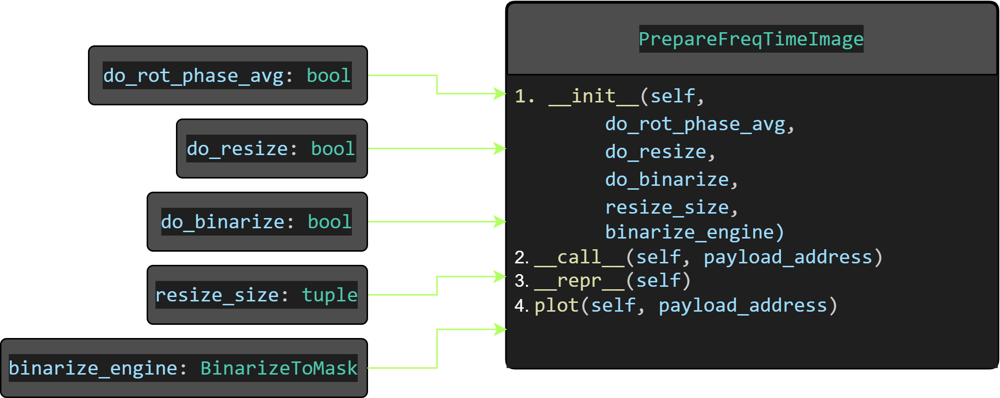

- ***Datasets:***
Datasets are used to create a memory map to data stored in disk/memory. In general, an instance of a dataset class (for instance dt) is initialized by taking a tag (to identify specific files stored in memory/disk), a directory path and an engine to load the files. Once initialized, the dataset instance allows you to access files or file-pairs using the __getitem__ attribute, like this: dt[idx].    

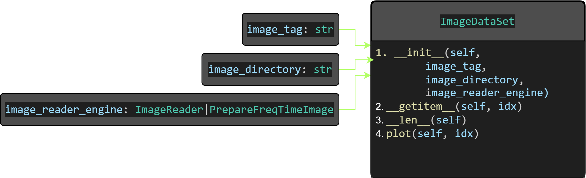


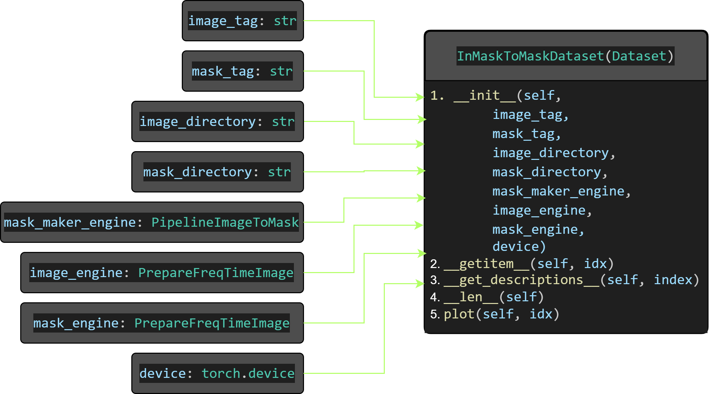

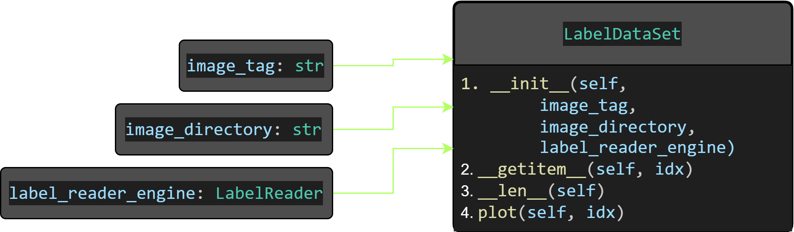

- ***Neural nets and their Trainers:*** 
Neural networks powered by pytorch (including 2D and 1D CNNs) are utilized at various stages of the framework to filter or segment signals from dispersion graphs. This is followed by additional filtering of the segmented signals and subsequent pulse identification. Three specific types of CNNs are used in the frameworks. In the current version for segmenting raw dispersion graphs, UNet is used to segment the signal followed by autoencoder type CNN referred to as FilterCNN to denoise the segmented signal. Later in the framework a encoder followed by fully connected layer is used to identify if pulsar is detected. Below are the example nets provided in this version for these specific tasks along with their corresponding trainer modules.

    - Segmentation CNN:  UNet
    - Filtering unnecessary segments: Autoencoder (we named it as FilterCNN)
    - Classifier: 1D CNN encoder - linear layers (we named it CNN1D)

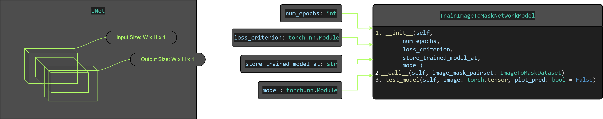

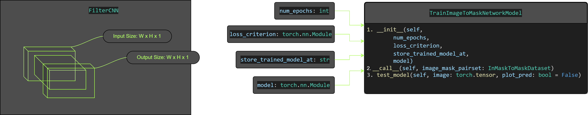

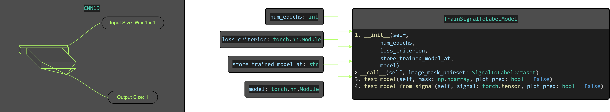


- ***Pipeline Modules:*** 
Pipelines are responsible for the overall process of identifying pulsar signals from dispersion graphs. As mentioned earlier, this release includes two specific types of pipelines. 
    - PipelineImageToFilterToCCtoLabels: This pipeline employs connected component analysis to locate signal positions within the dispersion graphs. Another twin pipeline is provided without the filtering network as PipelineImageToCCtoLabels
    - PipelineImageToFilterDelGraphtoIsPulsar: This pipeline compresses the 2D dispersion graph into a 1D representation, called a DelayGraph. A 1D CNN is then used to identify the presence of a pulsar signal. Another twin pipeline is provided without the filtering network as PipelineImageToDelGraphtoIsPulsar

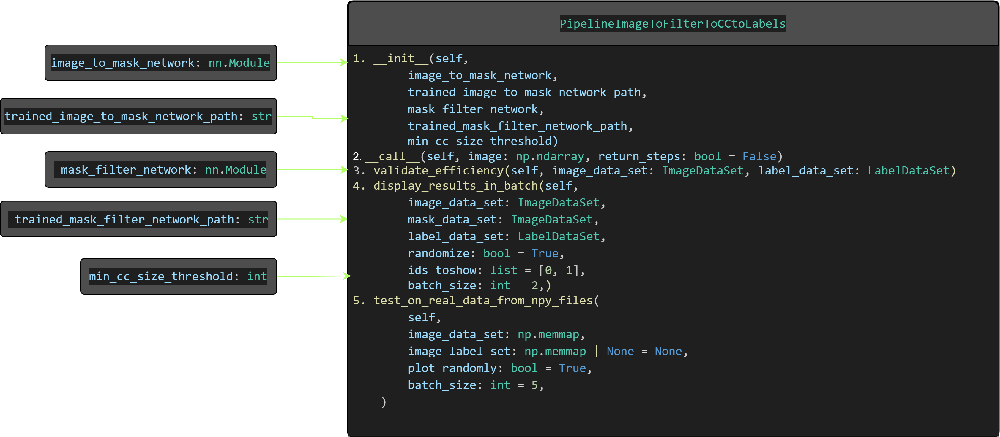 

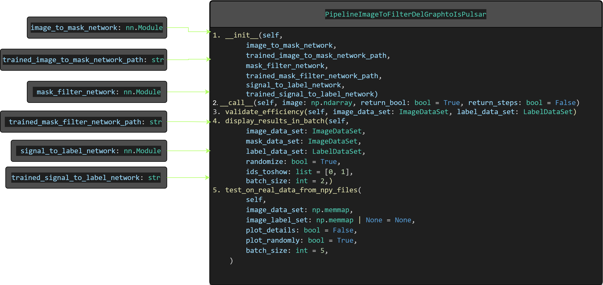 

An intermediate pipeline module is provided to convert dispersion images into segmented mask images, which are then used in the training process of FilterCNN.
    - PipelineImageToMask: Converts dispersion graphs to segmented signal images

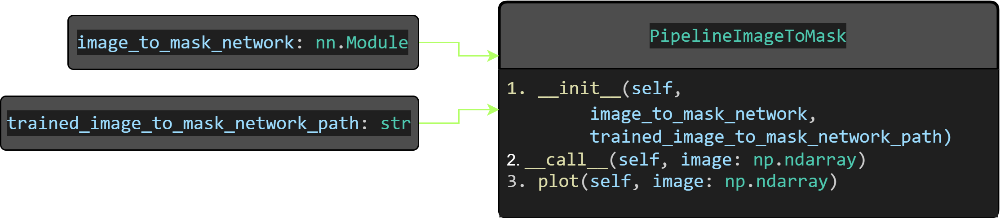 
    
- ***Tuner:***
A pipeline or neural network tuner is used to integrate similar neural network modules trained on different datasets. For example, a telescope in Africa may experience a distinct type of noise compared to one in Australia. If a new telescope is installed between these locations, it would hypothetically be exposed to noise characteristics from both regions. By parameterizing the neural networks trained in different locations, a new mixed pipeline or neural network module can be developed to detect pulsar signals without requiring additional training. This approach can also be applied to mitigate specific electronic noise caused by different hardware at the same location, ensuring more robust signal detection. The potential applications of this idea are manifold, spanning various fields that require adaptive noise filtering and signal enhancement.

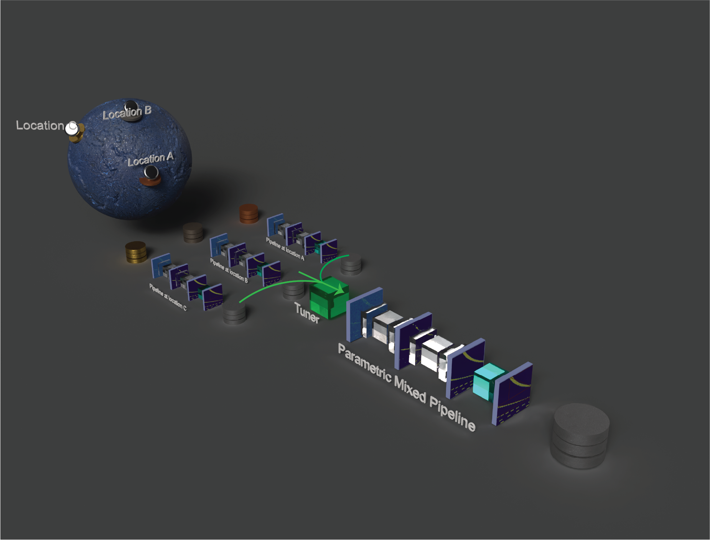

here is the visulaization of the module:

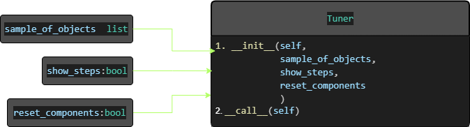

Please refer to this notebook for implementation [tune_pipelines.ipynb](./examples/tune_pipelines.ipynb)

To show the overall implementation of the pipeline use the example notebook [pipeline_pulsar_segmentation_and_analyze.ipynb](./examples/pipeline_pulsar_segmentation_and_analyze.ipynb)

## Implementation
This package is implemented in the ML-PPA pipeline as follows:
1. Synthetic data generation using PulsarDT.     
2. Model training (UNet, FilterCNN, CNN1D)
3. Test on real data

#### Synthetic data generation
(Please refer to ML-PPA/PulsarDT for details)

#### Model training
*_**NOTE**: Only important code blocks are illustrated below. Please do the necessary imports before running the code snippets_*  

**Step 1**: Load trainable data set
```python
from src import ImageToMaskDataset,InMaskToMaskDataset,SignalToLabelDataset
image_mask_train_dataset = ImageToMaskDataset(
                        image_tag = image_tag,
                        mask_tag= mask_tag,
                        image_directory = image_directory,
                        mask_directory = mask_directory,
                        image_engine=image_preprocessing_engine,
                        mask_engine=mask_preprocessing_engine
                        )
inmask_mask_train_dataset = InMaskToMaskDataset(
                        image_tag = image_tag,
                        mask_tag= mask_tag,
                        image_directory = image_directory,
                        mask_directory = mask_directory,
                        mask_maker_engine=mask_maker_engine,
                        image_engine=image_preprocessing_engine,
                        mask_engine=mask_preprocessing_engine
                        )

signal_label_train_dataset = SignalToLabelDataset(mask_tag=mask_tag,
                                            mask_directory=mask_directory,
                                            mask_engine=mask_preprocessing_engine,
                                            )
```
Below is an example of an image and mask pair:  

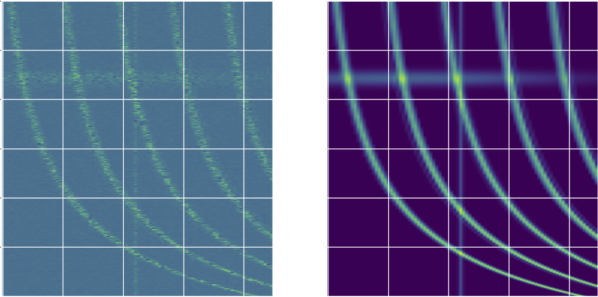 

**Step 2**: Initialize trainers and train 

```python
from src import TrainSignalToLabelModel,SignalToLabelDataset

store_trained_model_image2mask_at = './syn_data/model/trained_Unet_test_v0.pt'
image2mask_network_trainer = TrainImageToMaskNetworkModel(
                                model=UNet(),
                                num_epochs=10,
                                store_trained_model_at=store_trained_model_image2mask_at, #: Define path to store model params
                                loss_criterion = WeightedBCELoss(pos_weight=3,neg_weight=1)                                
                                )

store_trained_model_inmask2mask_at = './syn_data/model/trained_FilterCNN_test_v0.pt'
inmask2mask_network_trainer = TrainImageToMaskNetworkModel(
                                model= FilterCNN(),
                                num_epochs=3,
                                store_trained_model_at=store_trained_model_inmask2mask_at, #: Define path to store model params
                                loss_criterion = WeightedBCELoss(pos_weight=1,neg_weight=1)                               
                                )

store_trained_model_signal2label_at: str = './syn_data/model/trained_CNN1D_test_v0.pt'
signal2label_network_trainer = TrainSignalToLabelModel(
                                model=CNN1D(),
                                num_epochs=20,
                                loss_criterion=WeightedBCELoss(pos_weight=1,neg_weight=1),
                                store_trained_model_at=store_trained_model_signal2label_at, #: Define path to store model params                                                               
                                )
image2mask_network_trainer(image_mask_pairset=image_mask_train_dataset)
inmask2mask_network_trainer(image_mask_pairset=inmask_mask_train_dataset)
signal2label_network_trainer(signal_label_pairset=signal_label_train_dataset)
```


**Step 3**: Load trained networks to pipelines and test the result

```python
from src import PipelineImageToFilterDelGraphtoIsPulsar,PipelineImageToFilterToCCtoLabels
ppl1f = PipelineImageToFilterDelGraphtoIsPulsar(image_to_mask_network=UNet(),
                                        trained_image_to_mask_network_path=store_trained_model_image2mask_at,
                                        mask_filter_network=FilterCNN(),
                                        trained_mask_filter_network_path=store_trained_model_inmask2mask_at,
                                        signal_to_label_network=CNN1D(),
                                        trained_signal_to_label_network=store_trained_model_signal2label_at)

ppl2f = PipelineImageToFilterToCCtoLabels(image_to_mask_network=UNet(),
                                trained_image_to_mask_network_path=store_trained_model_image2mask_at,
                                mask_filter_network=FilterCNN(),
                                trained_mask_filter_network_path=store_trained_model_inmask2mask_at,
                                min_cc_size_threshold=5)

ppl1f.test_on_real_data_from_npy_files(image_data_set=data_subset[:,:,:],image_label_set=data_label_subset[:],plot_details=True,plot_randomly=True,batch_size=2)
ppl2f.test_on_real_data_from_npy_files(image_data_set=data_subset[:,:,:],image_label_set=data_label_subset[:],plot_randomly=True,batch_size=2)
```


Below is an example of an fake real pulsar segementation followed by labelling: 

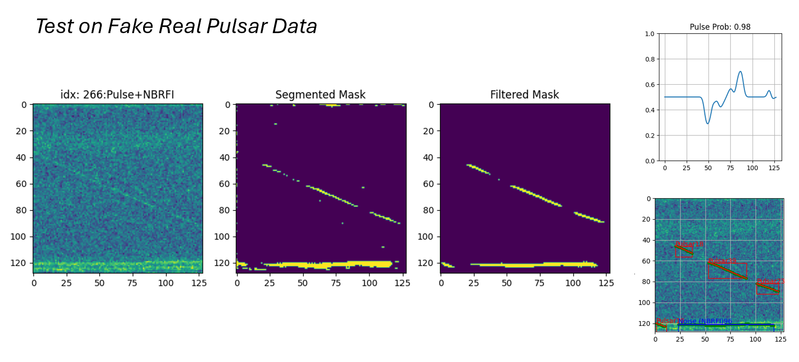

*_**NOTE**: Here the segementation process is acheived using a very small training batch (size: 500) in the local machine. The process can be improved by having a large training batch size with wide range of pulse types. Also we are working on improving the UNet model for better results_*


## Authors and acknowledgment
**Authors**: Tanumoy Saha   
**Acknowledgment**: We would like to acknowledge PUNCH4NFDI and InterTwin consortium for the funding and the members of TA5 for their valuable support 

## License
Free to use GNU GENERAL PUBLIC LICENSE Version 3.

## Project status
Initial stage of development (Version: 0.2).

